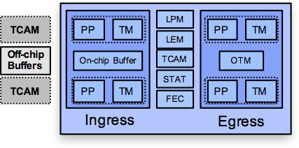
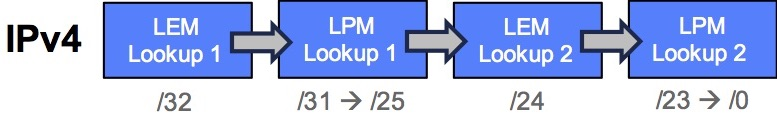
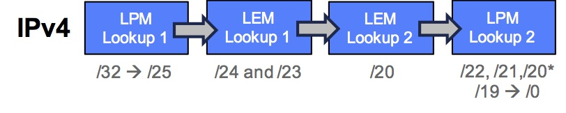
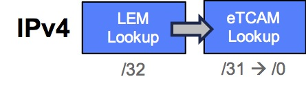

## NCS 5500 设备性能

### 硬件

  

NCS 5500 pipeline处理过程中，不同的block会访问不同的数据库，这些内存分别储存以下信息：

- The **Longest Prefix Match Database** (LPM sometimes referred to as KAPS for KBP Assisted Prefix Search, KBP being itself Knowledge Based Processor) is an SRAM used to store IPv4 and IPv6 prefixes. It’s an algorithmic memory qualified for 256k entries IPv4 and 128k entries IPv6 in the worst case. We will see it can go much higher with internet distribution. One exception with the Jericho+ used in NCS55A1-24H where LPM can store more than 1M IPv4 routes.
- The **Large Exact Match Database** (LEM) is used to store IPv4 and IPv6 routes also, plus MAC addresses and MPLS labels. It scales to 786k entries.
- The **Internal TCAM** (iTCAM) is used for Packet classification (ACL, QoS) and is 48k entries large.
- The FEC database is used to store NextHop (128k entries), containing also the FEC ECMP (4k entries).
- **Egress Encapsulation DB** (EEDB) is used for egress rewrites (96k entries), including adjacency encapsulation like link-local details from ARP, ND and for MPLS labels or GRE headers.


### IPv4 routes and FIB Profiles

#### base line card


```
RP/0/RP0/CPU0:NCS5500(config)#hw-module fib ipv4 scale ?
  host-optimized-disable  Configure Host optimization by default
  internet-optimized      Configure Intetrnet optimized
RP/0/RP0/CPU0:NCS5500(config)#
```

 

**host-optimized**是默认选项，处理顺序如下：



所有的查询在一个clock tick里完成，不会影响性能。这种模式适用于hosting公司或者数据中心内部


**Internet-optimized** 的处理如下 ：

  

正如名字所示，这种profile会把internet上最大量的路由放入最大的memory database：LEM(Large Exact Match)。


####  scale line cards 

  

> - LEM is 786k large
> - eTCAM can offer up to 2M IPv4 entries
> - Total IPv4 scale for scale systems is 786k + 2M = 2,786k routes