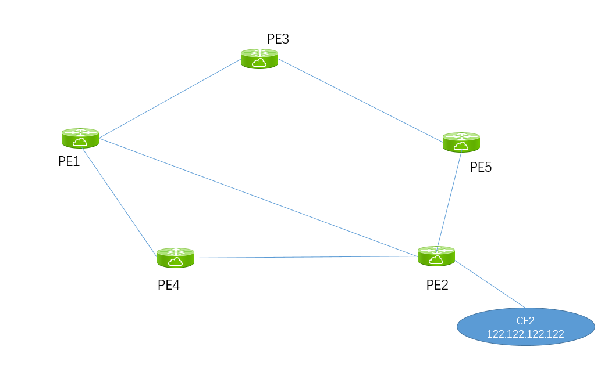

# SR POLICY 引流

拓扑：



在配置引流前，观察PE1上到CE2 122.122.122.122的转发表，下一跳就是PE2：

```
RP/0/RP0/CPU0:PE1#show cef vrf ctrip1000 122.122.122.122
Sun Sep 22 15:37:36.262 UTC
122.122.122.122/32, version 40, internal 0x5000001 0x0 (ptr 0x97d29c34) [1], 0x0 (0x0), 0x208 (0x984248a8)
 Updated Sep 22 15:36:08.929
 Prefix Len 32, traffic index 0, precedence n/a, priority 3
   via 2.2.2.2/32, 3 dependencies, recursive [flags 0x6000]
    path-idx 0 NHID 0x0 [0x970b50d8 0x0]
    recursion-via-/32
    next hop VRF - 'default', table - 0xe0000000
    next hop 2.2.2.2/32 via 17002/0/21
     next hop 10.1.2.2/32 BE1000.101   labels imposed {ImplNull 24001}
```

PE2配置如下：

```
extcommunity-set opaque GREEN
  30
end-set
!
route-policy COLOR_GREEN
  set extcommunity color GREEN
end-policy


router bgp 65510 
 vrf ctrip1000
   neighbor 112.112.112.1
   remote-as 65510
   address-family ipv4 unicast
    route-policy COLOR_GREEN in
    route-reflector-client
    route-policy pass out
    next-hop-self
    soft-reconfiguration inbound always
```

PE1上定义SR policy GREEN（真正生效的是color值30）:

```
segment-routing
 traffic-eng
  segment-list LIST1
   index 10 mpls label 17003
   index 20 mpls label 17002
  !
  policy GREEN
   color 30 end-point ipv4 2.2.2.2
   candidate-paths
    preference 100
     explicit segment-list LIST1
     !
```

PE1上查看BGP路由，可以看到CE2的路由带上了Color：30的extcommunity：

```
RP/0/RP0/CPU0:PE1#show bgp vrf ctrip1000 122.122.122.122
Sun Sep 22 15:44:24.425 UTC
BGP routing table entry for 122.122.122.122/32, Route Distinguisher: 1000:1000
Versions:
  Process           bRIB/RIB  SendTblVer
  Speaker                 56          56
Last Modified: Sep 22 15:43:27.651 for 00:00:57
Paths: (1 available, best #1)
  Not advertised to any peer
  Path #1: Received by speaker 0
  Not advertised to any peer
  Local
    2.2.2.2 C:30 (bsid:24013) (metric 20) from 2.2.2.2 (2.2.2.2)
      Received Label 24001
      Origin IGP, metric 0, localpref 100, valid, internal, best, group-best, import-candidate, imported
      Received Path ID 0, Local Path ID 1, version 56
      Extended community: Color:30 RT:1000:1000
      SR policy color 30, up, un-registered, bsid 24013
```


PE1上查看CEF:

```
RP/0/RP0/CPU0:PE1#show cef vrf ctrip1000 122.122.122.122
Sun Sep 22 15:44:33.038 UTC
122.122.122.122/32, version 42, internal 0x5000001 0x0 (ptr 0x97d29c34) [1], 0x0 (0x0), 0x208 (0x984247e8)
 Updated Sep 22 15:43:27.296
 Prefix Len 32, traffic index 0, precedence n/a, priority 3
   via local-label 24013, 3 dependencies, recursive [flags 0x6000]
    path-idx 0 NHID 0x0 [0x970b4838 0x0]
    recursion-via-label
    next hop VRF - 'default', table - 0xe0000000
    next hop via 24013/0/21
     next hop GREEN        labels imposed {ImplNull 24001}

```

