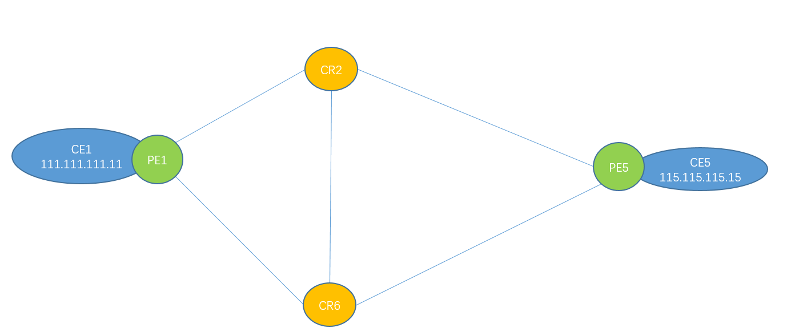
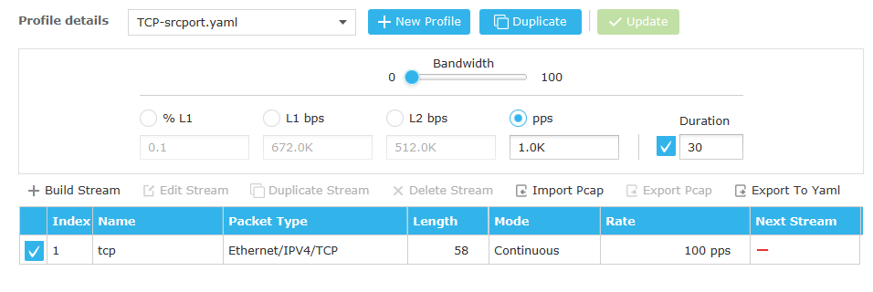
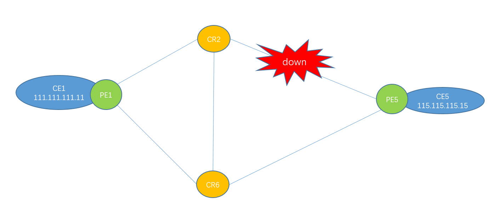
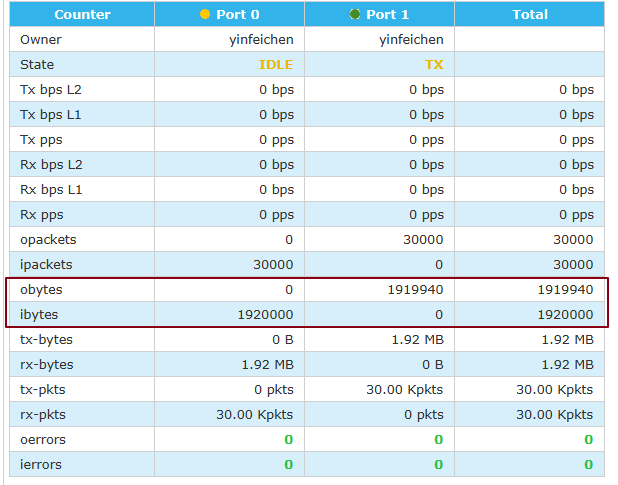
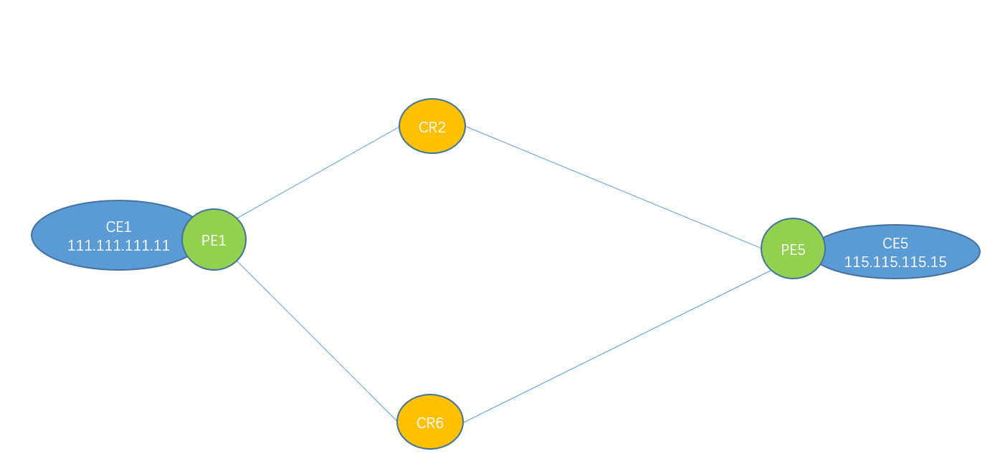

# Cisco TI-LFA测试



 

### Cisco TI-LFA配置

```
router isis 1
 !
 address-family ipv4 unicast
  metric-style wide
  mpls traffic-eng level-2-only
  mpls traffic-eng router-id Loopback0
  segment-routing mpls
 !
 interface Bundle-Ether1000.101
  point-to-point
  address-family ipv4 unicast
   fast-reroute per-prefix
   fast-reroute per-prefix ti-lfa
  !
 !
```


### Cisco TI-LFA验证

可以看到，CR2到PE5找到一条保护备份路径

```
RP/0/RP0/CPU0:CR2#show mpls forwarding labels 17005
Mon Oct 14 02:10:22.462 GMT+8
Local  Outgoing    Prefix             Outgoing     Next Hop        Bytes       
Label  Label       or ID              Interface                    Switched    
------ ----------- ------------------ ------------ --------------- ------------
17005  Pop         SR Pfx (idx 1005)  BE1001.101   10.2.5.5        107         
       17005       SR Pfx (idx 1005)  Gi0/0/0/12   10.2.6.6        309705710366 (!)
RP/0/RP0/CPU0:CR2#
RP/0/RP0/CPU0:CR2#
RP/0/RP0/CPU0:CR2#show mpls forwarding labels 17005 detail 
Mon Oct 14 02:10:28.717 GMT+8
Local  Outgoing    Prefix             Outgoing     Next Hop        Bytes       
Label  Label       or ID              Interface                    Switched    
------ ----------- ------------------ ------------ --------------- ------------
17005  Pop         SR Pfx (idx 1005)  BE1001.101   10.2.5.5        151         
     Updated: Oct 14 02:09:36.544
     Path Flags: 0x400 [  BKUP-IDX:0 (0x987a6af0) ]
     Version: 845, Priority: 1
     Label Stack (Top -> Bottom): { Imp-Null }
     NHID: 0x0, Encap-ID: 0x1382600000002, Path idx: 1, Backup path idx: 0, Weight: 0
     MAC/Encaps: 18/18, MTU: 1500
     Outgoing Interface: Bundle-Ether1001.101 (ifhandle 0x08000064)
     Packets Switched: 3

       17005       SR Pfx (idx 1005)  Gi0/0/0/12   10.2.6.6        309705710366 (!)
     Updated: Oct 14 02:09:36.544
     Path Flags: 0x300 [  IDX:0 BKUP, NoFwd ]
     Version: 845, Priority: 1
     Label Stack (Top -> Bottom): { 17005 }
     NHID: 0x0, Encap-ID: 0x1381700000002, Path idx: 0, Backup path idx: 0, Weight: 0
     MAC/Encaps: 14/18, MTU: 1500
     Outgoing Interface: GigabitEthernet0/0/0/12 (ifhandle 0x000002a8)
     Packets Switched: 4079709292
     (!): FRR pure backup

  Traffic-Matrix Packets/Bytes Switched: 0/0
```


### Cisco TI-LFA测试


在PE1上调整到CR6的isis metric为100，使得流量PE1->CR2->PE5，使用trex进行打流：



断开CR2-PE5链路：




可以看到有丢了60个包，按照1000pps速率，可以得出结论中断了60/1000 = 0.06s




中断后，再看标签转发表，

```
RP/0/RP0/CPU0:CR2(config-if)#do show mpls forwarding labels 17005  detail 
Mon Oct 14 02:17:40.765 GMT+8
Local  Outgoing    Prefix             Outgoing     Next Hop        Bytes       
Label  Label       or ID              Interface                    Switched    
------ ----------- ------------------ ------------ --------------- ------------
17005  17005       SR Pfx (idx 1005)  Gi0/0/0/12   10.2.6.6        579         
     Updated: Oct 14 02:15:10.093
     Path Flags: 0x400 [  BKUP-IDX:0 (0x987a5350) ]
     Version: 877, Priority: 1
     Label Stack (Top -> Bottom): { 17005 }
     NHID: 0x0, Encap-ID: 0x1381700000002, Path idx: 1, Backup path idx: 0, Weight: 0
     MAC/Encaps: 14/18, MTU: 1500
     Outgoing Interface: GigabitEthernet0/0/0/12 (ifhandle 0x000002a8)
     Packets Switched: 11

       Pop         SR Pfx (idx 1005)  Te0/0/0/3    10.1.2.1        309707872605 (!)
     Updated: Oct 14 02:15:10.093
     Path Flags: 0xb00 [  IDX:0 BKUP, NoFwd ]
     Version: 877, Priority: 1
     Label Stack (Top -> Bottom): { Imp-Null 24015 17005 }
     NHID: 0x0, Encap-ID: 0x1388000000003, Path idx: 0, Backup path idx: 0, Weight: 0
     MAC/Encaps: 14/22, MTU: 1500
     Outgoing Interface: TenGigE0/0/0/3 (ifhandle 0x000001b0)
     Packets Switched: 4079739323
     (!): FRR pure backup

  Traffic-Matrix Packets/Bytes Switched: 0/0
```

注意到，当前的保护路径会压入标签24015及17005。

看下面 PE1生成的ISIS LSP，可以得知，24015是PE1为接CR6分配的Adj sid

```
RP/0/RP0/CPU0:CR2#show isis database PE1.00-00  verbose 
Mon Oct 14 02:18:55.226 GMT+8

IS-IS 1 (Level-2) Link State Database
LSPID                 LSP Seq Num  LSP Checksum  LSP Holdtime/Rcvd  ATT/P/OL
PE1.00-00             0x000011ee   0x1ce1        885  /1200         0/0/0
  Area Address:   47.0004.004d.0001
  NLPID:          0xcc
  IP Address:     1.1.1.1
  Router ID:      1.1.1.1
  Metric: 10         IP-Extended 1.1.1.1/32
    Prefix-SID Index: 1001, Algorithm:0, R:0 N:1 P:0 E:0 V:0 L:0
    Prefix Attribute Flags: X:0 R:0 N:1
    Source Router ID: 1.1.1.1
  Metric: 10         IP-Extended 10.1.2.0/24
    Prefix Attribute Flags: X:0 R:0 N:0
  Metric: 10         IP-Extended 10.1.3.0/24
    Prefix Attribute Flags: X:0 R:0 N:0
  Metric: 0          IP-Extended 19.19.19.0/24
    Prefix Attribute Flags: X:0 R:0 N:0
  Metric: 100        IP-Extended 10.1.6.0/24
    Prefix Attribute Flags: X:0 R:0 N:0
  Hostname:       PE1
  Router Cap:     1.1.1.1 D:0 S:0
    Segment Routing: I:1 V:0, SRGB Base: 16000 Range: 8000
    SR Local Block: Base: 15000 Range: 1000
    SR Algorithm: 
      Algorithm: 0
      Algorithm: 1
      Algorithm: 128
    Node Maximum SID Depth: 
      Label Imposition: 0
    Flex-Algo Definition: 
      Algorith: 128 Metric-Type: 0 Alg-type: 0 Priority: 255
      Flex-Algo Exclude Ext Admin Group:
        0x00000004
...省略其余链路...
  Metric: 100        IS-Extended CR6.00
    Affinity: 0x00000000
    Interface IP Address: 10.1.6.1
    Neighbor IP Address: 10.1.6.6
    Physical BW: 10000000 kbits/sec
    Reservable Global pool BW: 0 kbits/sec
    Global Pool BW Unreserved: 
      [0]: 0        kbits/sec          [1]: 0        kbits/sec
      [2]: 0        kbits/sec          [3]: 0        kbits/sec
      [4]: 0        kbits/sec          [5]: 0        kbits/sec
      [6]: 0        kbits/sec          [7]: 0        kbits/sec
    Admin. Weight: 100
    Ext Admin Group: Length: 32
      0x00000000   0x00000000
      0x00000000   0x00000000
      0x00000000   0x00000000
      0x00000000   0x00000000
    Link Maximum SID Depth: 
      Label Imposition: 6
      ADJ-SID: F:0 B:0 V:1 L:1 S:0 P:0 weight:0 Adjacency-sid:24015
```


而在下面图中，对于CR2来说到PE5的保护路径，先后会压入标签17006，17005




```
RP/0/RP0/CPU0:CR2#show mpls forwarding labels 17005  detail 
Mon Oct 14 06:42:34.275 GMT+8
Local  Outgoing    Prefix             Outgoing     Next Hop        Bytes       
Label  Label       or ID              Interface                    Switched    
------ ----------- ------------------ ------------ --------------- ------------
17005  Pop         SR Pfx (idx 1005)  BE1001.101   10.2.5.5        535         
     Updated: Oct 14 06:42:31.336
     Path Flags: 0x400 [  BKUP-IDX:0 (0x987a5350) ]
     Version: 1154, Priority: 1
     Label Stack (Top -> Bottom): { Imp-Null }
     NHID: 0x0, Encap-ID: 0x1382600000002, Path idx: 1, Backup path idx: 0, Weight: 0
     MAC/Encaps: 18/18, MTU: 1500
     Outgoing Interface: Bundle-Ether1001.101 (ifhandle 0x08000064)
     Packets Switched: 10

       17006       SR Pfx (idx 1005)  Te0/0/0/3    10.1.2.1        309713771338 (!)
     Updated: Oct 14 06:42:31.336
     Path Flags: 0xb00 [  IDX:0 BKUP, NoFwd ]
     Version: 1154, Priority: 1
     Label Stack (Top -> Bottom): { 17006 17005 } 		//先压入标签17006，再压入17005
     NHID: 0x0, Encap-ID: 0x1388f00000003, Path idx: 0, Backup path idx: 0, Weight: 0
     MAC/Encaps: 14/22, MTU: 1500
     Outgoing Interface: TenGigE0/0/0/3 (ifhandle 0x000001b0)
     Packets Switched: 4079819470
     (!): FRR pure backup
```

