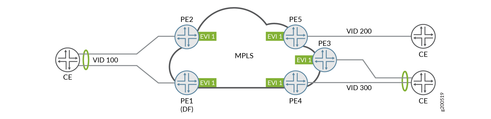

# Juniper L2VPN


## 1. VLAN BASED

### 情形1 


所有的PE上使用同一个VID，这样是不需要VLAN转换的。使用命令 `VLAN-id=none` ，移除originating VID，并且把MPLS FRAME里的Ethernet tag ID设置为0  （这里应该叙述有误，Ethernet tag ID应该是在EVPN路由中携带的）

### 情形2

所有PE上使用同一个VID，不需要VLAN转换，而在MPLS frame里，还是有CE-VID。

### 情形3



严格遵循RFC 7432，所有的translation发生在egress PE设备上，可以在MPLS frame里携带originating VID，所有的EVPN路由里的Ethernet Tag ID设置为0。所以需要配置命令`VLAN-id = none` 以及 `no-normalization` 。这样可以让所有的ce使用不同的vid。

```

[edit routing-instances evpn-l2]
ctrip@PE5# show 
instance-type evpn;
protocols {
    evpn {
        label-allocation per-instance;
    }
}
vlan-id none;
interface xe-0/1/7.100;
no-normalization;
route-distinguisher 5555:5555;
vrf-target target:2000:2000;
```


以下是CE接PE，不带任何VLAN的配置：

```
[edit interfaces xe-0/1/7]
ctrip@PE5# show 
encapsulation ethernet-bridge;
gigether-options {
    auto-negotiation;
    speed 1g;
}
unit 0 {
    family bridge;
}


[edit routing-instances evpn-l2]
ctrip@PE5# show 
instance-type evpn;
protocols {
    evpn {
        label-allocation per-instance;
    }
}
vlan-id none;
interface xe-0/1/7.0;
no-normalization;
route-distinguisher 5555:5555;
vrf-target target:2000:2000;
```

