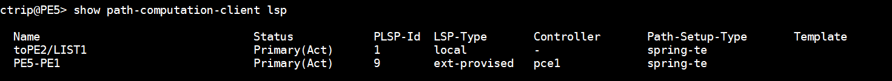

Juniper PCEP下发隧道配置


Juniper PCEP配置

```
[edit protocols pcep]
ctrip@PE5# show 
pce pce1 {
    local-address 5.5.5.5;
    destination-ipv4-address 19.19.19.9;
    destination-port 4189;
    pce-type active stateful;
    lsp-provisioning;
    spring-capability;
}
```


验证PCE状态：

```
ctrip@PE5> show path-computation-client status       

Session              Type                        Provisioning   Status         Uptime
  pce1               Stateful Active             On             Up              9262        

LSP Summary
  Total number of LSPs        : 1        
  Static LSPs                 : 1        
  Externally controlled LSPs  : 0        
  Externally provisioned LSPs : 0/16000 (current/limit)
  Orphaned LSPs               : 0        

pce1 (main)
  Delegated              : 0               
  Externally provisioned : 0               

```


```
ctrip@PE5> show path-computation-client active-pce 

PCE pce1
--------------------------------------------
General
    PCE IP address           : 19.19.19.9
    Local IP address         : 5.5.5.5
    Priority                 : 0
    PCE status               : PCE_STATE_UP
    Session type             : PCE_TYPE_STATEFULACTIVE
    LSP provisioning allowed : On
    P2MP LSP report allowed  : Off
    P2MP LSP update allowed  : Off
    P2MP LSP init allowed    : Off
    PCE-mastership           : main

Counters
    PCReqs              Total: 0            last 5min: 0            last hour: 0        
    PCReps              Total: 0            last 5min: 0            last hour: 0        
    PCRpts              Total: 15           last 5min: 1            last hour: 2        
    PCUpdates           Total: 0            last 5min: 0            last hour: 0        
    PCCreates           Total: 12           last 5min: 1            last hour: 2        

Timers
    Local  Keepalive timer:   30 [s]  Dead timer:  120 [s]  LSP cleanup timer:    0 [s]
    Remote Keepalive timer:   30 [s]  Dead timer:  120 [s]  LSP cleanup timer:    0 [s]

Errors
    PCErr-recv
    PCErr-sent
            Type: 19            Value: 1            Count: 3          
    PCE-PCC-NTFS
    PCC-PCE-NTFS

Last errors
    Last-PCErr-sent
            Type: 19            Value: 1        

Pcupdate empty ero action counters
    Send-err               : 0
    Tear down path         : 0
    Routing decision       : 0
    Routing decision failed: 0
```


PCE下发隧道前，PE5上只有一条手动配置的LSP：


此时，从PE5上看到CE1的路由，走IGP两条等价路径：

```
ctrip@PE5> show route forwarding-table vpn ctrip1000 destination 111.111.111.0    
Routing table: ctrip1000.inet
Internet:
Enabled protocols: Bridging, All VLANs, 
Destination        Type RtRef Next hop           Type Index    NhRef Netif
111.111.111.0/24   user     0                    indr  1048575     3
                                                 ulst  1048581     2
                              10.3.5.3          Push 24015, Push 17001(top)      632     2 ae0.101
                              10.2.5.2          Push 24015, Push 17001(top)      642     2 xe-0/1/1.101
```


PE5->PE1 LSP表项为通过ISIS/14学到的：

```
ctrip@PE5> show route table inet.3  

inet.3: 5 destinations, 6 routes (5 active, 0 holddown, 0 hidden)
+ = Active Route, - = Last Active, * = Both

1.1.1.1/32         *[L-ISIS/14] 19:57:23, metric 30
                    >  to 10.3.5.3 via ae0.101, Push 17001
                       to 10.2.5.2 via xe-0/1/1.101, Push 17001
```


通过pathman定义，发一条LSP（PE5->CR2->CR3->PE1）：


可以看到出现了一条新的LSP




看到这条LSP的detail

```
ctrip@PE5> show spring-traffic-engineering lsp name PE5-PE1 detail 
Name: PE5-PE1
Tunnel-source: Path computation element protocol(PCEP)
To: 1.1.1.1
State: Up
  Outgoing interface: NA
  Auto-translate status: Disabled Auto-translate result: N/A
  Compute Status:Disabled , Compute Result:N/A , Compute-Profile Name:N/A
  BFD status: N/A BFD name: N/A
  SR-ERO hop count: 3
    Hop 1 (Strict): 
      NAI: IPv4 Node ID, Node address: 6.6.6.6
      SID type: 20-bit label, Value: 17006
    Hop 2 (Strict): 
      NAI: IPv4 Node ID, Node address: 2.2.2.2
      SID type: 20-bit label, Value: 17002
    Hop 3 (Strict): 
      NAI: IPv4 Node ID, Node address: 1.1.1.1
      SID type: 20-bit label, Value: 17001
```


PE5到PE1的LSP表项，有效的那条变为SPRING-TE/8（更高优先级），先后压入标签17001，17002。不用压入17006因为PHP：

```
ctrip@PE5> show route table inet.3 1.1.1.1 

inet.3: 5 destinations, 7 routes (5 active, 0 holddown, 0 hidden)
+ = Active Route, - = Last Active, * = Both

1.1.1.1/32         *[SPRING-TE/8] 00:03:34, metric 1, metric2 10
                    >  to 10.5.6.6 via xe-0/1/4.0, Push 17001, Push 17002(top)
                       to 10.2.5.2 via xe-0/1/1.101, Push 17001, Push 17002, Push 17006(top)
                    [L-ISIS/14] 20:06:09, metric 30
                    >  to 10.3.5.3 via ae0.101, Push 17001
                       to 10.2.5.2 via xe-0/1/1.101, Push 17001
```


在看PE5上VPN实例到CE1的路由，变为压入标签17001,17002，也就是PE1到PE5的VPN流量走了这条路径

```
ctrip@PE5> show route forwarding-table vpn ctrip1000 destination 111.111.111.0 detail 
Routing table: ctrip1000.inet
Internet:
Enabled protocols: Bridging, All VLANs, 
Destination        Type RtRef Next hop           Type Index    NhRef Netif
111.111.111.0/24   user     0                    indr  1048575     3
                              10.5.6.6          Push 24015, Push 17001, Push 17002(top)      634     2 xe-0/1/4.0
```

