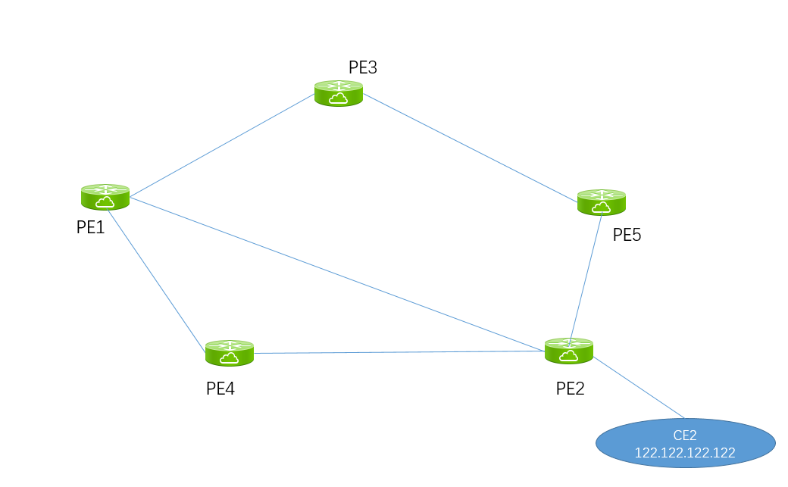
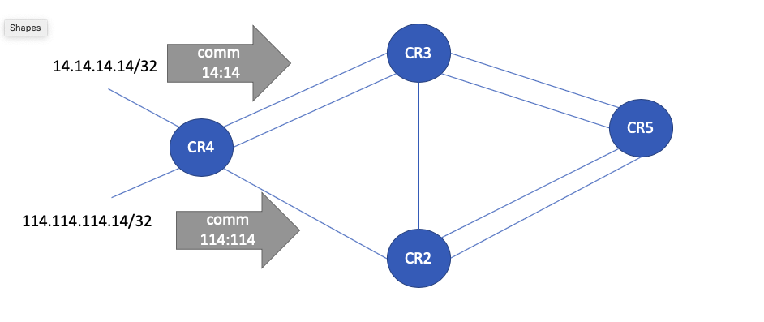
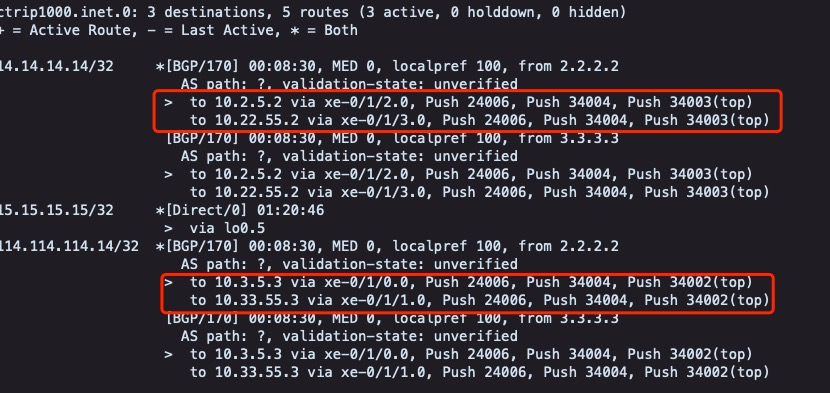

# 引流

## COLOR-LSP 引流




```
[edit protocols source-packet-routing]
admin@PE5# show 
sr-preference 5; z
segment-list LIST1 {
    hop1 label 17003;
    hop2 label 17001;
    hop3 label 17002;
}
source-routing-path toPE2 {
    to 2.2.2.2;
    color 30;
    preference 100;
    primary {
        LIST1;
    }
}
```


```
admin@PE5> show spring-traffic-engineering lsp name toPE2 detail 
Name: toPE2
Tunnel-source: Static configuration
To: 2.2.2.2-30<c>
State: Up
  Path: LIST1
  Outgoing interface: NA
  Auto-translate status: Disabled Auto-translate result: N/A
  Compute Status:Disabled , Compute Result:N/A , Compute-Profile Name:N/A
  BFD status: N/A BFD name: N/A
  SR-ERO hop count: 3
    Hop 1 (Strict): 
      NAI: None
      SID type: 20-bit label, Value: 17003
    Hop 2 (Strict): 
      NAI: None
      SID type: 20-bit label, Value: 17001
    Hop 3 (Strict): 
      NAI: None
      SID type: 20-bit label, Value: 17002
```


```
admin@PE5> show route protocol bgp 122.122.122.122 table admin1000.inet detail   

admin1000.inet.0: 10 destinations, 10 routes (10 active, 0 holddown, 0 hidden)
122.122.122.122/32 (1 entry, 1 announced)
        *BGP    Preference: 170/-101
                Route Distinguisher: 1000:1000
                Next hop type: Indirect, Next hop index: 0
                Address: 0x7e1b35c
                Next-hop reference count: 9
                Source: 2.2.2.2
                Next hop type: Router, Next hop index: 622
                Next hop: 10.2.5.2 via xe-0/1/1.101, selected
                Label operation: Push 24001
                Label TTL action: prop-ttl
                Load balance label: Label 24001: None; 
                Label element ptr: 0xd594240
                Label parent element ptr: 0x4bd1c70
                Label element references: 1
                Label element child references: 0
                Label element lsp id: 0
                Session Id: 0x143
                Protocol next hop: 2.2.2.2
                Label operation: Push 24001
                Label TTL action: prop-ttl
                Load balance label: Label 24001: None; 
                Indirect next hop: 0x7208808 1048577 INH Session ID: 0x14b
                State: <Secondary Active Int Ext ProtectionCand>
                Local AS: 65510 Peer AS: 65510
                Age: 20:29:52   Metric: 0       Metric2: 20 
                Validation State: unverified 
                ORR Generation-ID: 0 
                Task: BGP_65510.2.2.2.2
                Announcement bits (1): 0-KRT 
                AS path: I 
                Communities: target:1000:1000 color:0:30   <<<<
                Import Accepted
                VPN Label: 24001
                Localpref: 100
                Router ID: 2.2.2.2
                Primary Routing Table bgp.l3vpn.0
```


## NON-COLOR LSP

## 



在CR5上，定义了，两条non-color SR-TE LSP

```
[edit protocols source-packet-routing]
admin@CR5# show 
lsp-external-controller pccd;
maximum-segment-list-depth 16;
segment-list LST_234 {
    hop1 label 34002;
    hop2 label 34003;
    hop3 label 34004;
}
segment-list LST_324 {
    hop1 label 34003;
    hop2 label 34002;
    hop3 label 34004;
}


source-routing-path toCR4_2 {
    to 4.4.4.4;
    preference 3;
    primary {
        LST_324;
    }
}
source-routing-path toCR4_1 {
    to 4.4.4.4;
    preference 3;
    primary {
        LST_234;
    }
}
```


定义了一条policy-statement

community 为14:14和114:114的，分别会调用不同的LSP:

```
admin@CR5# run show configuration policy-options 
policy-statement LSP_SLCT {
    term 1 {
        from community comm14
        then {
            install-nexthop lsp toCR4_ECMP;
            accept;
        }
    }
    term 2 {
        from community comm114;
        then {
            install-nexthop lsp toCR4_2;
            accept;
        }
    }
}

community comm114 members 114:114;
community comm14 members 14:14;
```


查看路由表，可以发现到14.14.14.14/32和 114.114.114.14/32 分别选择了不同的路径：



注：

使用community 引流，有一定的限制，当路由器存在到对端PE的多条LSP时，如果存在一条preference更优的LSP，即使通过policy-option将特定community的路由引流到次优的LSP，也不会生效。

