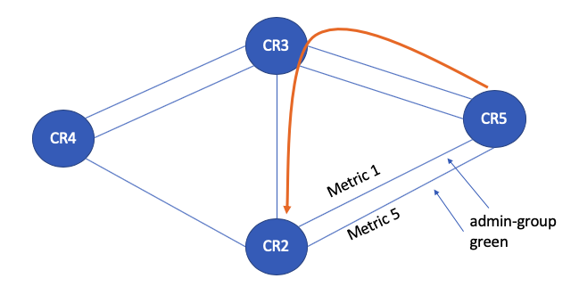

#  SR-TE LSP

## 2. admin group


CR5 -CR2 的两条链路metric为1和5，拓扑中其余链路metric均为10

将CR2-CR5的链路设置为admin-group green

CR5定义一跳到CR2的LSP，约束条件为exclude green，可以看到，这条隧道是绕开了和CR2的直连链路。而是经由CR3到达。



```
set protocols isis traffic-engineering igp-topology
set protocols isis traffic-engineering advertisement always

set protocols mpls admin-groups green 1
set protocols mpls interface xe-0/1/2.0 admin-group green
set protocols mpls interface xe-0/1/3.0 admin-group green

set protocols source-packet-routing compute-profile non_hadoop admin-group exclude green
set protocols source-packet-routing source-routing-path CR5-CR2 to 2.2.2.2
set protocols source-packet-routing source-routing-path CR5-CR2 primary pri_path compute non_hadoop
```


```
ctrip@CR5# run show spring-traffic-engineering lsp name  ？ detail 
Name: CR5-CR2
Tunnel-source: Static configuration
To: 2.2.2.2
State: Up
Telemetry statistics:
Sensor-name: ingress-CR5-CR2, Id: 3758096387
  Path: pri_path
  Outgoing interface: NA
  Auto-translate status: Disabled Auto-translate result: N/A
  Compute Status:Enabled , Compute Result:success , Compute-Profile Name:non_hadoop
  Total number of computed paths: 1
    Computed-path-index: 1
  BFD status: N/A BFD name: N/A
    computed segments count: 2
      computed segment : 1 (computed-node-segment): 
        node segment label: 17003
        router-id: 3.3.3.3
      computed segment : 2 (computed-node-segment): 
        node segment label: 17002
        router-id: 2.2.2.2
```


问题： 

到第一跳 3.3.3.3，是否是负载均衡


## PRI_PATH之间的负载均衡

在一条LSP中，配置了多条primary path

```
ctrip@CR5# run show configuration protocols source-packet-routing source-routing-path toCR4_2
to 4.4.4.4;
preference 1;
primary {
    LST_CR4_2 weight 2;
    LIST2 weight 3;
}
```


根据下面配置，114：114的路由，会被引导到toCR4_2这条path

```
ctrip@CR5# run show configuration policy-options policy-statement LSP_SLCT
term 1 {
    from community 14:14;
    then {
        install-nexthop lsp toCR4_ECMP;
        accept;
    }
}
term 2 {
    from community 114:114;
    then {
        install-nexthop lsp toCR4_2;
        accept;
    }
}
```


在路由表中，并未体现：

```
ctrip@CR5> show route 114.114.114.14 table ctrip1000.inet

ctrip1000.inet.0: 3 destinations, 5 routes (3 active, 0 holddown, 0 hidden)
+ = Active Route, - = Last Active, * = Both

114.114.114.14/32  *[BGP/170] 00:15:02, MED 0, localpref 100, from 2.2.2.2
                      AS path: ?, validation-state: unverified
                    >  to 10.3.5.3 via xe-0/1/0.0, Push 24006, Push 34004, Push 34002(top)
                       to 10.33.55.3 via xe-0/1/1.0, Push 24006, Push 34004, Push 34002(top)
                    [BGP/170] 00:15:02, MED 0, localpref 100, from 3.3.3.3
                      AS path: ?, validation-state: unverified
                    >  to 10.3.5.3 via xe-0/1/0.0, Push 24006, Push 34004, Push 34002(top)
                       to 10.33.55.3 via xe-0/1/1.0, Push 24006, Push 34004, Push 34002(top)

```

