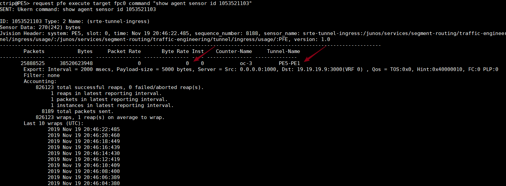
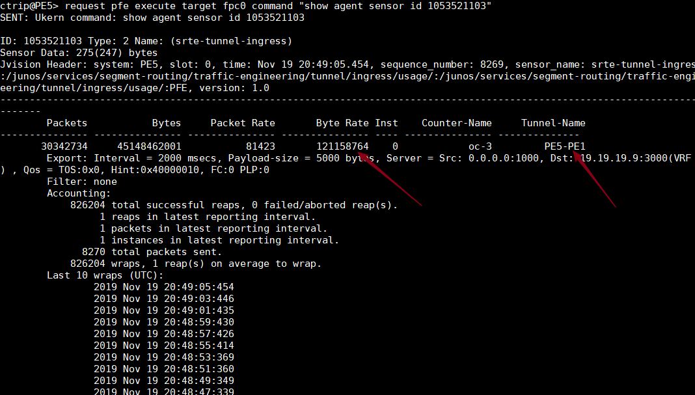

# Juniper 基于SID的流量统计

配置步骤：


1- 配置 telemetry

```
ctrip@PE5> show configuration services analytics 
streaming-server ns {
    remote-address 19.19.19.9;
    remote-port 3000;
}
export-profile ns {
    reporting-rate 2;
    format gpb;
    transport udp;
}
sensor per-sid-ingress {
    server-name ns;
    export-name ns;
    resource /junos/services/segment-routing/sid/usage/;
}
sensor srte-ingress {
    server-name ns;
    export-name ns;
    resource /junos/services/segment-routing/traffic-engineering/ingress/usage/;
}
sensor srte-tunnel-ingress {
    server-name ns;
    export-name ns;
    resource /junos/services/segment-routing/traffic-engineering/tunnel/ingress/usage/;
}
```

```
ctrip@PE5> show configuration protocols source-packet-routing telemetry 
statistics;
```

```
ctrip@PE5> show configuration protocols isis source-packet-routing 
sensor-based-stats {
    per-sid ingress egress;
}
srgb start-label 16000 index-range 10000;
node-segment {
    ipv4-index 1005;
    ipv6-index 2005;
}
traffic-statistics {
    statistics-granularity per-interface;
}
```


2- 查看telemetry sensor-id

```
ctrip@PE5> show agent sensors | match "resour|sensor" | except parent    
Sensor Information : 
    Resource                                : /junos/services/segment-routing/sid/usage/ 
    Sensor-id                               : 2903098284            
Sensor Information : 
           
    Name                                    : sensor_1000           
    Resource                                : /junos/events/event[id='CHASSISD_SNMP_TRAP7']/ 
    Sensor-id                               : 539528115             
Sensor Information : 
           
    Name                                    : sensor_1001           
    Resource                                : /junos/system/cmerror/configuration/ 
    Sensor-id                               : 539528114             
Sensor Information : 
           
    Name                                    : sensor_1002           
    Resource                                : /junos/system/cmerror/counters/ 
    Sensor-id                               : 539528113             
Sensor Information : 
           
    Name                                    : sensor_1003           
    Resource                                : /components/          
    Sensor-id                               : 539528112             
Sensor Information :                    
    Resource                                : /junos/services/segment-routing/traffic-engineering/ingress/usage/ 
    Sensor-id                               : 2718858849            
Sensor Information : 
    Resource                                : /junos/services/segment-routing/traffic-engineering/tunnel/ingress/usage/ 
    Sensor-id                               : 1053521103            
```


3- 通过sensor-id 查看流量统计

从PE5定义了一条到PE1的 non-color SR-TE LSP PE5-PE1

打流前：



打流中：




限制说明：

