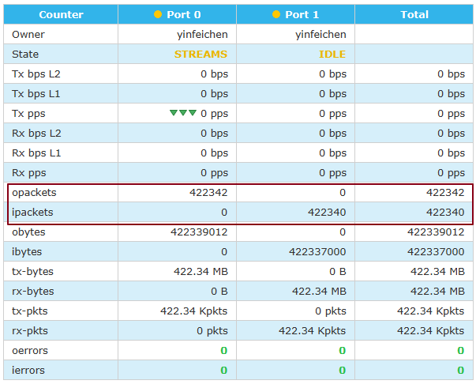

# Juniper TI-LFA测试


测试基于上图，途中CR6和PE5都是Juniper设备，修改PE5-CR2的isis，metric，使得CE5->CE1的流量走PE5 ->CR6 ->PE1

### Juniper TI-LFA配置

以下显示TI-LFA的必要配置

```
[edit protocols isis]
ctrip@CR6# show 
backup-spf-options {
    use-post-convergence-lfa;
}

interface ge-2/1/0.0 {
    point-to-point;
    level 2 {
        post-convergence-lfa;
```


### 验证路由表

```
ctrip@CR6> show route table inet.3 1.1.1.1 

inet.3: 5 destinations, 5 routes (5 active, 0 holddown, 0 hidden)
+ = Active Route, - = Last Active, * = Both

1.1.1.1/32         *[L-ISIS/14] 10:50:41, metric 20
                    >  to 10.1.6.1 via xe-2/2/0.0
                       to 10.2.6.2 via ge-2/1/0.0, Push 17001
```


### 验证mpls标签表

从转发表看，有2个下一跳，实际上并没有负载均衡，另外一个下一跳实际是TI-LFA的保护路径

```
ctrip@CR6> show route table mpls.0 label 17001         

mpls.0: 20 destinations, 20 routes (20 active, 0 holddown, 0 hidden)
+ = Active Route, - = Last Active, * = Both

17001              *[L-ISIS/14] 00:00:16, metric 20
                    >  to 10.1.6.1 via xe-2/2/0.0, Pop      
                       to 10.2.6.2 via ge-2/1/0.0, Swap 17001
17001(S=0)         *[L-ISIS/14] 00:00:16, metric 20
                    >  to 10.1.6.1 via xe-2/2/0.0, Pop      
                       to 10.2.6.2 via ge-2/1/0.0, Swap 17001
```


### 测试

断开CR6-PE1


测下来有2个丢包




此时看CR6的路由表，18是PE5-CR2的adj-sid

```
ctrip@CR6> show route table mpls.0 label 17001      

mpls.0: 17 destinations, 17 routes (17 active, 0 holddown, 0 hidden)
+ = Active Route, - = Last Active, * = Both

17001              *[L-ISIS/14] 00:06:53, metric 30
                    >  to 10.2.6.2 via ge-2/1/0.0, Swap 17001
                       to 10.5.6.5 via xe-2/2/1.0, Swap 17001, Push 18(top)
```


查看CR6的转发表

```
ctrip@CR6> show route forwarding-table label 17001    
Routing table: default.mpls
MPLS:
Destination        Type RtRef Next hop           Type Index    NhRef Netif
17001              user     0                    ulst  1048585     2
                              10.2.6.2          Swap 17001      548     2 ge-2/1/0.0
                              10.5.6.5          Swap 17001, Push 18(top)      553     2 xe-2/2/1.0
```


总结：收敛速率符合预期，不过查看表项有问题