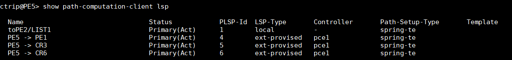
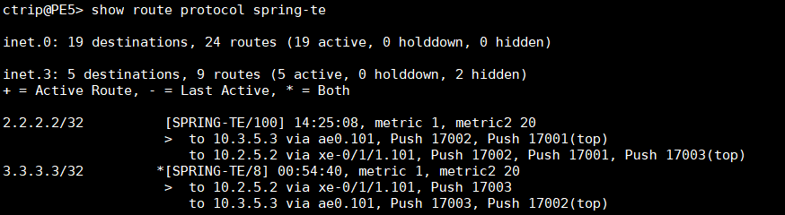
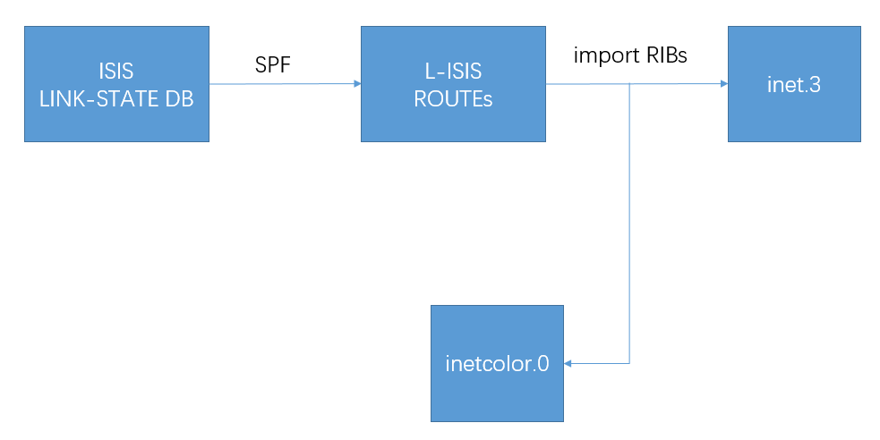
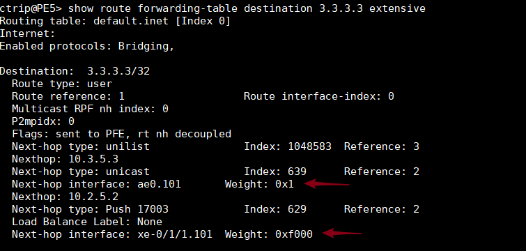
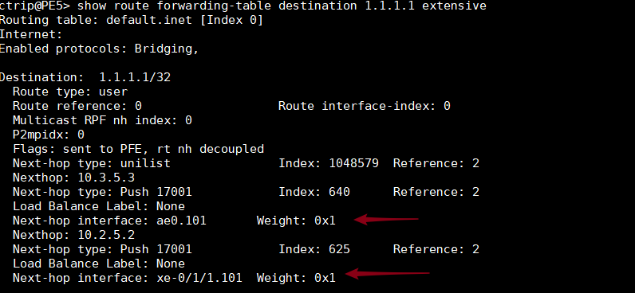
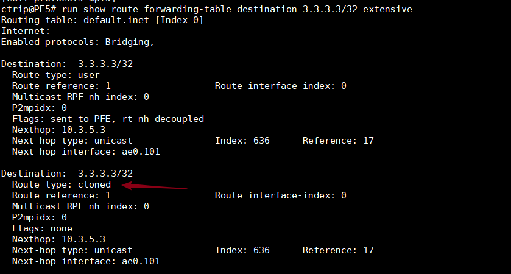
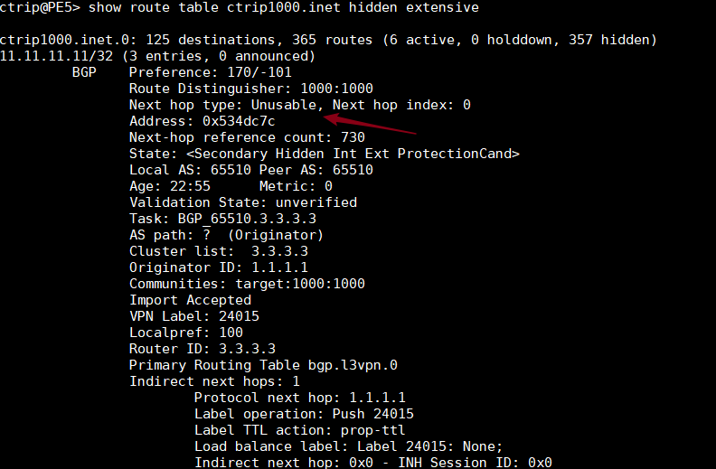

# Juniper 问题整理

[TOC]


### 问题1 PCE下发LSP

1 - 设备上有如下几条LSP，第一条未静态配置，后面3条为ODL（PCE）下发




2 - 三条ODL下发的LSP，只有3.3.3.3出现在sprint-te路由表中

 


### 问题2 几张table的区别

BGP VPNV4 路由会查inet.3 

inet.0 路由表 

inet.3 标签交换表


```
mpls {
        traffic-engineering {
            bgp-igp-both-ribs;
        }
```

有了上面的配置，inet.3表会放进inet.0，所以IGP学到的prefix会被解析成label。普通 v4的bgp路由会使用inet.0和inet.3表解析协议下一跳。


### 问题3 SR-POLICY的fallback策略

bgp vpnv4的路由带color属性的话，下一跳为3.3.3.3-25<c>  会到inetcolor表里去找下一跳，如果没有下一跳，会不会fallback

> color SR-TE LSP的fallback配置： vpnv4路由如果带了color，会使用inetcolor.0解析下一跳，如果inetcolor.0表中没有带color的SR-TE lsp，可以使用inetcolor.0的L-ISIS路由进行解析。下面配置作用就是把L-ISIS路由放到inet.3和inetcolor两张表中去（默认L-ISIS只会放到inet.3表）。
>
> ```
> set routing-options rib-groups l-isis-inetcolor import-rib inet.3
> set routing-options rib-groups l-isis-inetcolor import-rib inetcolor.0
> set protocols isis rib-group inet3 l-isis-inetcolor
> ```
>


关于上面三条命令的解释：

> 第一、二条命令，是创建一个rib-group，叫 l-isis-inetcolor
>
> 第三条命令是应用
>
> 但是应用的地方不同，会反过来决定第一、二步创建rib-group时表的前后顺序不一样；primary rib的表要放在第一个。这个例子中L-ISIS路由默认的primary rib 是inet.3, 所以在第一、二步创建表的时候inet.3必须写在第一个。

以下为流程示意图：




配置完以后，

```
ctrip@PE5# run show route table inetcolor.0 

inetcolor.0: 5 destinations, 5 routes (5 active, 0 holddown, 0 hidden)
+ = Active Route, - = Last Active, * = Both

1.1.1.1-0<c>/32                
                   *[L-ISIS/14] 00:00:04, metric 30
                    >  to 10.3.5.3 via ae0.101, Push 17001
                       to 10.2.5.2 via xe-0/1/1.101, Push 17001
2.2.2.2-0<c>/32                
                   *[L-ISIS/14] 00:00:04, metric 20
                    >  to 10.2.5.2 via xe-0/1/1.101
                       to 10.3.5.3 via ae0.101, Push 17002
3.3.3.3-0<c>/32                
                   *[L-ISIS/14] 00:00:04, metric 20
                    >  to 10.3.5.3 via ae0.101
                       to 10.2.5.2 via xe-0/1/1.101, Push 17003
4.4.4.4-0<c>/32                
                   *[L-ISIS/14] 00:00:04, metric 20
                    >  to 10.3.5.3 via ae0.101, Push 17004
                       to 10.2.5.2 via xe-0/1/1.101, Push 17004
6.6.6.6-0<c>/32                
                   *[L-ISIS/14] 00:00:04, metric 10
                    >  to 10.5.6.6 via xe-0/1/4.0
                       to 10.2.5.2 via xe-0/1/1.101, Push 17006
```


### 问题4 TI-LFA和ECMP的区分

当开启了TI-LFA后，路由表中会多出一个下一跳。但是这个显示上和到该目的网段有多条等价路径的显示 结果一样，难以区分

例如，下面的路由为等价路径：

```
ctrip@PE5# run show route table inet.3 1.1.1.1 

inet.3: 5 destinations, 6 routes (5 active, 0 holddown, 0 hidden)
+ = Active Route, - = Last Active, * = Both

1.1.1.1/32         *[L-ISIS/14] 4d 13:32:40, metric 30
                    >  to 10.3.5.3 via ae0.101, Push 17001
                       to 10.2.5.2 via xe-0/1/1.101, Push 17001
```


而下面的路由的第二跳其实是保护路径

```
ctrip@PE5# run show route table inet.3 3.3.3.3                                                                      

inet.3: 5 destinations, 6 routes (5 active, 0 holddown, 0 hidden)
+ = Active Route, - = Last Active, * = Both

3.3.3.3/32         *[L-ISIS/14] 4d 13:30:30, metric 20
                    >  to 10.3.5.3 via ae0.101
                       to 10.2.5.2 via xe-0/1/1.101, Push 17003
```

在关闭了ti-lfa之后：

```
ctrip@PE5# run show route table inet.3 3.3.3.3 

inet.3: 5 destinations, 6 routes (5 active, 0 holddown, 0 hidden)
+ = Active Route, - = Last Active, * = Both

3.3.3.3/32         *[L-ISIS/14] 00:00:06, metric 20
                    >  to 10.3.5.3 via ae0.101
```

Juniper 工程师答复：

> 确认实际哪些下一跳转发的方法：> show route forwarding-table destination 10.9.9.5 extensive  ，每个next-hop带weight值，weight值最小的才实际转发流量 ；LFA的备路径也直接安装到转发表里是为了主路径失败时的快速切换。




该例子中的2个下一跳，第一个为实际转发流量，第二个为保护路径




该例子中的2个下一跳为等价路径


更快的查询方式：

```
ctrip@PE5> show route 3.3.3.3 table inet.0 extensive active-path | match "entr|weight" 
3.3.3.3/32 (2 entries, 1 announced)
                Next hop: 10.3.5.3 via ae0.101 weight 0x1, selected
                Next hop: 10.2.5.2 via xe-0/1/1.101 weight 0xf000
```


### 问题5 cloned route

转发表中，会出现一条类型为clone的条目



关于cloned解释：

> cloned (clon)—(TCP or multicast only) Cloned route.
>
> 本地设备和那个路由有tcp会话，于是在转发表clone一个


### 问题6 路由条目hidden

在路由表中，显示有些路由条目hidden

```
ctrip@PE5> show route table ctrip1000.inet         

ctrip1000.inet.0: 125 destinations, 365 routes (6 active, 0 holddown, 357 hidden)
+ = Active Route, - = Last Active, * = Both

22.22.22.22/32     *[BGP/170] 2w4d 04:59:53, MED 0, localpref 100, from 2.2.2.2
                      AS path: ?, validation-state: unverified
                    >  to 10.5.6.6 via xe-0/1/4.0, Push 24017, Push 17002(top)
33.33.33.33/32     *[BGP/170] 2w4d 04:59:53, MED 0, localpref 100, from 3.3.3.3
                      AS path: ?, validation-state: unverified
                    >  to 10.5.6.6 via xe-0/1/4.0, Push 24012, Push 17003(top)
44.44.44.44/32     *[BGP/170] 2w4d 04:59:53, MED 0, localpref 100, from 2.2.2.2
                      AS path: I, validation-state: unverified
                    >  to 10.5.6.6 via xe-0/1/4.0, Push 48259, Push 17004(top)
                    [BGP/170] 2w4d 04:59:53, MED 0, localpref 100, from 3.3.3.3
                      AS path: I, validation-state: unverified
                    >  to 10.5.6.6 via xe-0/1/4.0, Push 48259, Push 17004(top)
                    [BGP/170] 2w4d 04:59:53, MED 0, localpref 100, from 6.6.6.6
                      AS path: I, validation-state: unverified
                    >  to 10.5.6.6 via xe-0/1/4.0, Push 48259, Push 17004(top)
55.55.55.55/32     *[Direct/0] 7w6d 00:48:55
                    >  via lo0.5
115.115.115.0/24   *[Direct/0] 7w4d 23:29:56
                    >  via xe-0/1/7.0
115.115.115.1/32   *[Local/0] 7w4d 23:29:56
                       Local via xe-0/1/7.0
```

> 通常是下一跳不可达会导致hidden



经验证发现，之前定义的non-color SR-TE LSP如下

```
[edit protocols source-packet-routing]
ctrip@PE5# show 
lsp-external-controller pccd;
segment-list path-PE5-PE1 {
    segCR3 label 17003;
    segCR2 label 17002;
    segPE1 label 17001;
}
source-routing-path PE5-PE1 {
    to 1.1.1.1;
    primary {
        path-PE5-PE1;
    }
}
```

PE5-CR3的链路为down，vpn路由就变为无效，而当PE5-CR3间链路up了之后，这些vpn路由即为有效

原因分析：默认情况下，接口支持的的maximum label数量为3个，在该例中定义的路径中有3个label，再加上VPNlabel的话一共有4个label。而当PE5-CR3之间的链路为down的情况下，会压入所有这4个label，进行转发。而当PE5-CR3链路up了之后，17003label其实会被pop，这样只有3个label被压入转发给下一跳CR3。

解决方案：

1. 接口下，设置maximum label，juniper支持的最大标签栈为16

```
ctrip@PE5# set interfaces xe-0/1/2 unit 0 family mpls maximum-labels 10
```

2. 全局设置

   

### 