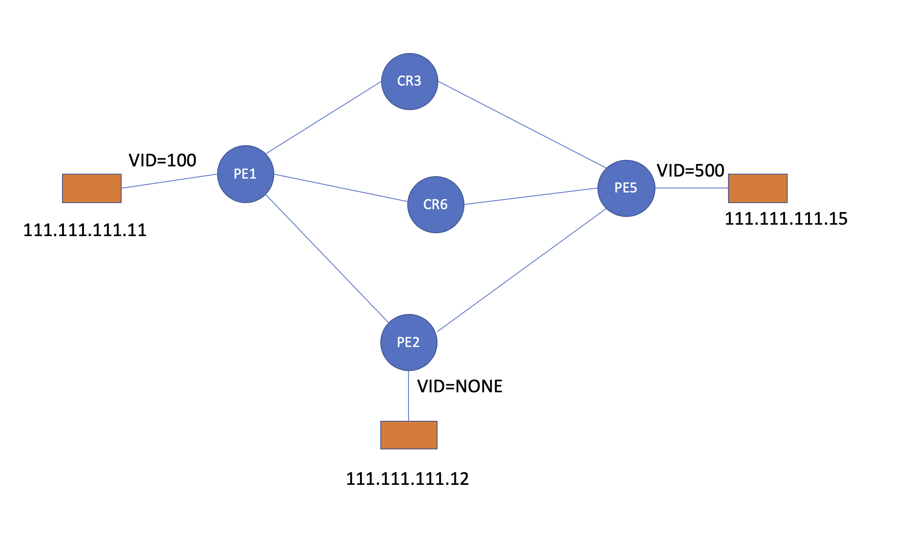

# L2VPN  over SR

## 测试目的：

验证多厂商路由器对于L2VPN over SR的兼容性功能。

## 拓扑：

下图中，PE1、PE2、CR3为思科NCS5500, CR3和PE5为Juniper MX系列路由器

其中CR3、CR6同时为路由反射器



## 配置：

基于vlan-based配置模式

### PE1（Cisco）

```
evpn
 evi 55
  bgp
   rd 2000:2000
   route-target import 2000:2000
   route-target export 2000:2000
  !
  advertise-mac
  !
 !
!

l2vpn
 bridge group EVPN_ALL_ACTIVE
  bridge-domain EVPN_55
   interface Bundle-Ether1001.201
   !
   evi 55
   !
  !
 !
!
interface Bundle-Ether1001.201 l2transport
 encapsulation dot1q 201
 rewrite ingress tag pop 1 symmetric #一定要配置，让MPLS FRAME里不携带ORIGINATING VID
!


router bgp 65510	
 address-family link-state link-state
 
  neighbor 2.2.2.2
  address-family l2vpn evpn
   soft-reconfiguration inbound always
  !
```

PE2同PE1，唯一区别是接口没有dot1q

### PE 5 (juniper配置）

以下为PE的接入侧端口为dot1q封装

```
[edit interfaces xe-0/1/7]
admin@PE5# show 
flexible-vlan-tagging
encapsulation flexible-ethernet-services;
gigether-options {
    auto-negotiation;
    speed 1g;
}
unit 500 {
    encapsulation vlan-bridge;
    vlan-id 500
}


[edit routing-instances evpn-l2]
admin@PE5# show 
instance-type evpn;
protocols {
    evpn {
        label-allocation per-instance;
    }
}
vlan-id none;
interface xe-0/1/7.500;
no-normalization;
route-distinguisher 5555:5555;
vrf-target target:2000:2000;

```


以下为PE的接入侧端口为null封装

```
[edit interfaces xe-0/1/7]
admin@PE5# show 
encapsulation ethernet-bridge;
gigether-options {
    auto-negotiation;
    
    speed 1g;
}
unit 0 {
    family bridge;
}


[edit routing-instances evpn-l2]
admin@PE5# show 
instance-type evpn;
protocols {
    evpn {
        label-allocation per-instance;
    }
}
vlan-id none;
interface xe-0/1/7.0;
no-normalization;
route-distinguisher 5555:5555;
vrf-target target:2000:2000;
```


### 问题1

一开始CE2无法ping同CE5，当CE5向CE2发起ping或者ping一个不存在的地址之后，CE2能够ping通CE5。


