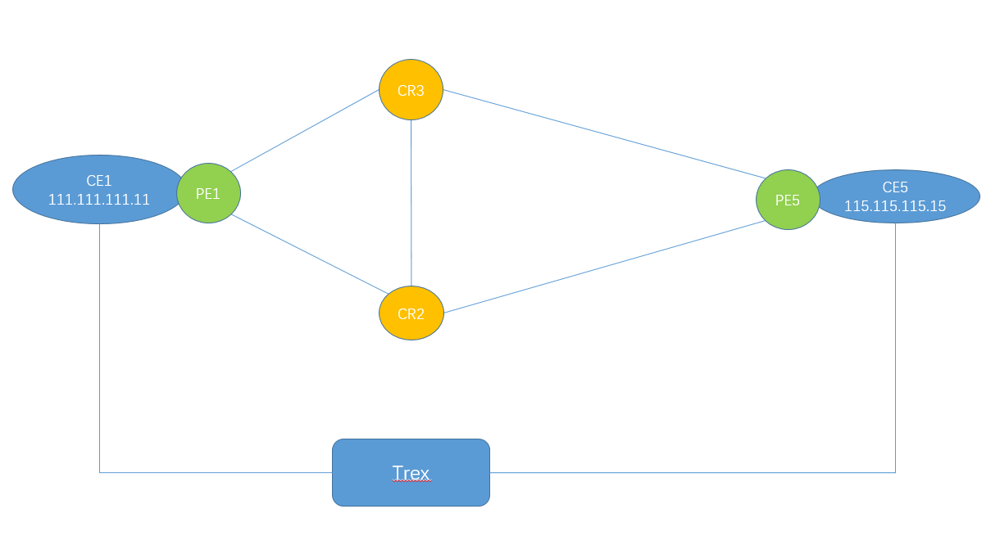
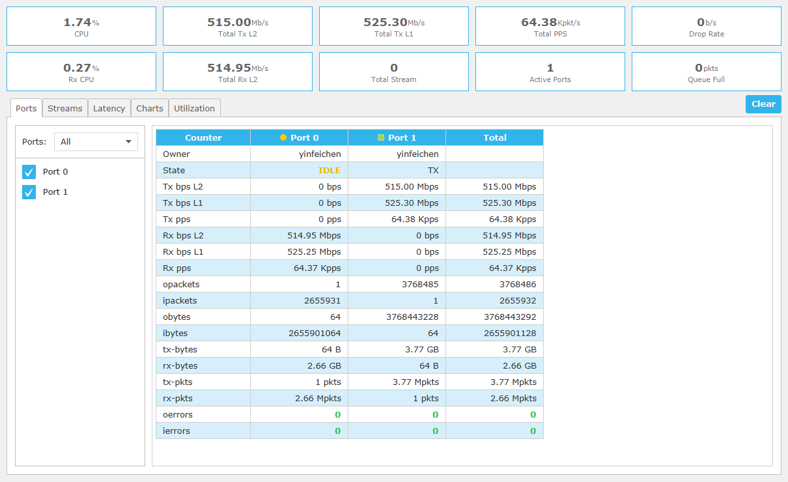
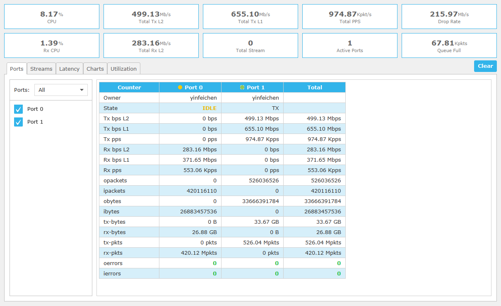

# QoS测试

[TOC]

本测试使用trex开源软件，基于以下拓扑进行测试




## Cisco - PE入向QoS Policing

CE1 往 CE5打流500M




在PE1上看接口（到CR2/CR3的流量），各有250多M，因为加上MPLS开销，所以总和会大于500M。packet数量较为吻合。

```
RP/0/RP0/CPU0:PE1#show interfaces tenGigE 0/0/0/0 | in rate
Mon Oct 14 06:48:38.930 UTC
  30 second input rate 1000 bits/sec, 0 packets/sec
  30 second output rate 256391000 bits/sec, 31921 packets/sec
RP/0/RP0/CPU0:PE1#show interfaces tenGigE 0/0/0/1 | in rate
Mon Oct 14 06:48:39.454 UTC
  30 second input rate 1000 bits/sec, 1 packets/sec
  30 second output rate 259787000 bits/sec, 32216 packets/sec
```


在PE1上做如下qos配置，根据ip地址进行流量识别，并限速到300mbps

```
ipv4 access-list CE1-CE5
 10 permit ipv4 111.111.111.0/24 115.115.115.0/24
 
class-map match-any ce1-ce5
 match access-group ipv4 CE1-CE5 
 end-class-map
 
policy-map Ing_Policing
 class ce1-ce5
  police rate 300 mbps 
  ! 
  set mpls experimental imposition 4
 ! 
 class class-default
 ! 
 end-policy-map
```


下面是根据dscp分类：

```
class-map match-any ce1-ce5
 match dscp ef 
 end-class-map
```


在接口调用：

```
interface GigabitEthernet0/0/0/26.100
 service-policy input Ing_Policing
 vrf admin1000
 ipv4 address 111.111.111.1 255.255.255.0
 encapsulation dot1q 100
```


可以看到速度降了下来：




## Cisco P入向 根据EXP限速

PE1对特定流量打上mpls exp 4

```
policy-map Ing_Policing
 class ce1-ce5
  set mpls experimental imposition 4
 ! 
 class class-default
```


随后在CR3的入向上，对exp4 进行匹配，并进行限速：

```
class-map match-any exp-4
 match mpls experimental topmost 4 
 end-class-map
! 
!
policy-map Ing-Plc
 class exp-4
  police rate percent 3 
  ! 
 ! 
 class class-default
 ! 
 end-policy-map
```


在接口上调用：

```
interface Bundle-Ether1000.101
 service-policy input Ing-Plc
 ipv4 address 10.1.3.3 255.255.255.0
 encapsulation dot1q 101
```


#### 注意

原先是的策略为，直接设置rate （例如100M），但是在bundles接口上无法调用，有如下报错：

```
interface Bundle-Ether1000.101
 service-policy input Ing-Plc
!!% 'qos-lib' detected the 'warning' condition 'MQC: Policer rate should be specified as percentage (or) per-thousand (or) per-million in bundles'
!
```

bundler需要设置percent，这也是为之后往bundler里添加成员接口的扩展性考虑


