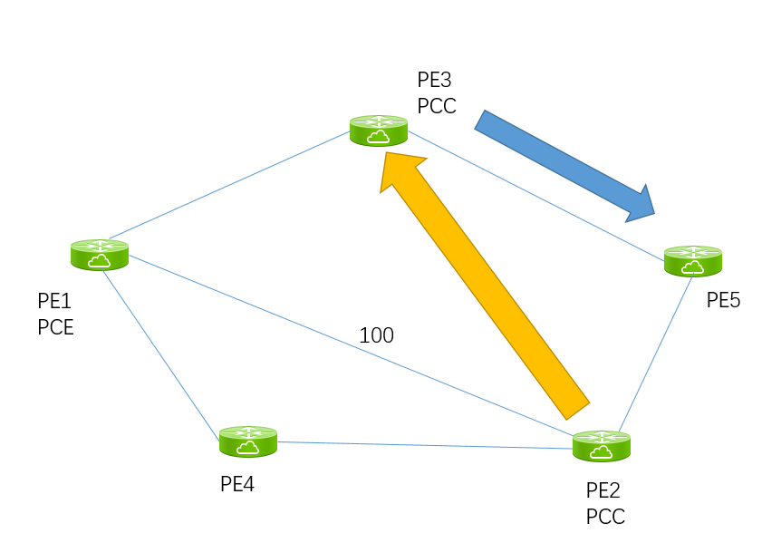

# SR PCE不相交路径




注：PE2->PE1之间的metric调整为100，其余均为默认10


PE1为PCE:

```
pce
 address ipv4 1.1.1.1
!
```


PE2&PE3为PCC

```
segment-routing
 traffic-eng
  pcc
   source-address ipv4 2.2.2.2	//PE3为3.3.3.3
   pce address ipv4 1.1.1.1
   !
   report-all
  !
 !
!
```


首先在PE3上定义一条到PE5的SR-policy，计算metric类型为igp，计算方式为动态pcep。约束条件为disjointpath，group-id为1

```
RP/0/RP0/CPU0:PE3#show running-config segment-routing 
Tue Sep 24 05:14:15.494 UTC
segment-routing
 traffic-eng
  maximum-sid-depth 5
  policy PLCY1
   color 20 end-point ipv4 5.5.5.5
   candidate-paths
    preference 100
     dynamic
      pcep
      !
      metric
       type igp
      !
     !
     constraints
      disjoint-path group-id 1 type node
     !
    !
   !
  !
```

验证：

```
RP/0/RP0/CPU0:PE3#show segment-routing traffic-eng policy 
Tue Sep 24 05:15:44.800 UTC

SR-TE policy database
---------------------

Name: PLCY1 (Color: 20, End-point: 5.5.5.5)
  Status:
    Admin: up  Operational: up for 00:06:13 (since Sep 24 05:09:31.619)
  Candidate-paths:
    Preference 100:
      Path Metrics:
        Margin Absolute: 0
        Margin Relative: 0% 
        Maximum SID Depth: 5 
      Dynamic (pce 1.1.1.1) (active)
        Metric Type: IGP,   Path Accumulated Metric: 10 
          24007 [Adjacency-SID, 10.3.5.3 - 10.3.5.5]
  Attributes:
    Binding SID: 24010
      Allocation mode: dynamic
      State: Programmed
      Policy selected: yes
    Forward Class: 0
    Steering BGP disabled: no
    IPv6 caps enable: no
```


然后在PE2上建立一条到PE3的SR-POLICY。和PE3上的策略有相同的约束条件

可以看到路径经过PE1到PE3：

```
RP/0/RP0/CPU0:PE2#show segment-routing traffic-eng policy name PLCY1 
Mon Sep 23 21:13:08.701 GMT+8

SR-TE policy database
---------------------

Name: PLCY1 (Color: 20, End-point: 3.3.3.3)
  Status:
    Admin: up  Operational: up for 00:01:20 (since Sep 23 21:11:48.476)
  Candidate-paths:
    Preference 100:
      Path Metrics:
        Margin Absolute: 0
        Margin Relative: 0% 
        Maximum SID Depth: 6 
      Dynamic (pce 1.1.1.1) (active)
        Metric Type: IGP,   Path Accumulated Metric: 30 
          24007 [Adjacency-SID, 10.2.4.2 - 10.2.4.4]
          48052 [Adjacency-SID, 10.1.4.4 - 10.1.4.1]
          24011 [Adjacency-SID, 10.1.3.1 - 10.1.3.3]
  Attributes:
    Binding SID: 24016
      Allocation mode: dynamic
      State: Programmed
      Policy selected: yes
    Forward Class: 0
    Steering BGP disabled: no
    IPv6 caps enable: no
```


在PE2上把disjoint.的 属性改为2（与PE3上的不同）之后，PE2->PE3的路径则是走IGP最短路径（PE2->PE5->PE3）

```

Name: PLCY1 (Color: 20, End-point: 3.3.3.3)
  Status:
    Admin: up  Operational: up for 00:04:11 (since Sep 23 21:11:48.476)
  Candidate-paths:
    Preference 100:
      Path Metrics:
        Margin Absolute: 0
        Margin Relative: 0% 
        Maximum SID Depth: 6 
      Dynamic (pce 1.1.1.1) (active)
        Metric Type: IGP,   Path Accumulated Metric: 20 
          17003 [Prefix-SID, 3.3.3.3]
  Attributes:
    Binding SID: 24016
      Allocation mode: dynamic
      State: Programmed
      Policy selected: yes
    Forward Class: 0
    Steering BGP disabled: no
    IPv6 caps enable: no

```

