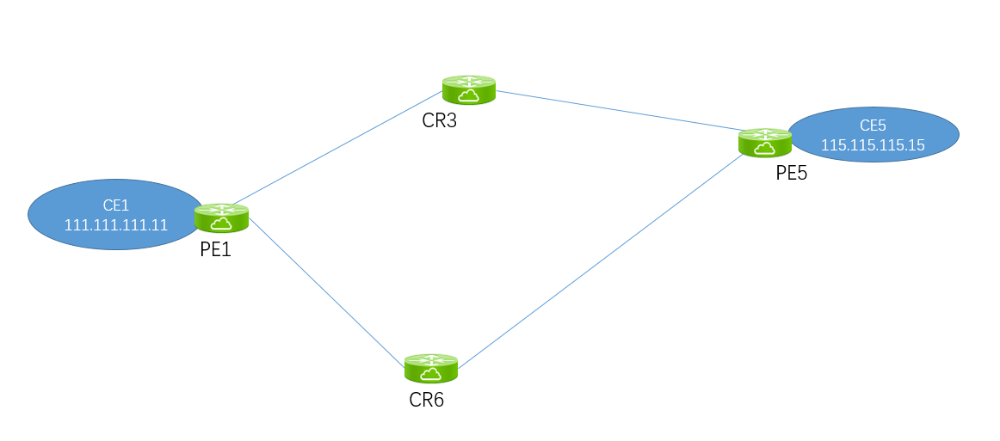

# 骨干网SR功能测试

[TOC]

## ECMP 



### Cisco ECMP

```
RP/0/RP0/CPU0:PE1#show cef vrf admin1000 115.115.115.115 detail 
Thu Sep 26 15:55:36.659 UTC
115.115.115.0/24, version 72, internal 0x5000001 0x0 (ptr 0x97d2ceec) [1], 0x0 (0x0), 0x208 (0x984244a8)
 Updated Sep 26 10:10:33.300
 Prefix Len 24, traffic index 0, precedence n/a, priority 3
  gateway array (0x97d5cdf8) reference count 2, flags 0x2038, source rib (7), 0 backups
                [1 type 1 flags 0x48441 (0x9846c588) ext 0x0 (0x0)]
  LW-LDI[type=0, refc=0, ptr=0x0, sh-ldi=0x0]
  gateway array update type-time 1 Sep 26 10:10:33.300
 LDI Update time Sep 26 10:10:33.300
   via 5.5.5.5/32, 3 dependencies, recursive [flags 0x6000]
    path-idx 0 NHID 0x0 [0x970b5610 0x0]
    recursion-via-/32
    next hop VRF - 'default', table - 0xe0000000
    next hop 5.5.5.5/32 via 17005/0/21
     next hop 10.1.6.6/32 Te0/0/0/6    labels imposed {17005 16}
     next hop 10.1.3.3/32 BE1001.101   labels imposed {17005 16}


    Load distribution: 0 (refcount 1)

    Hash  OK  Interface                 Address
    0     Y   Unknown                   17005/0        
```


但是在ingress PE上，看不到labels 17005的packets/bytes 统计：

```
RP/0/RP0/CPU0:PE1#show mpls forwarding  labels 17005
Thu Sep 26 15:53:39.042 UTC
Local  Outgoing    Prefix             Outgoing     Next Hop        Bytes       
Label  Label       or ID              Interface                    Switched    
------ ----------- ------------------ ------------ --------------- ------------
17005  17005       SR Pfx (idx 1005)  Te0/0/0/6    10.1.6.6        0           
       17005       SR Pfx (idx 1005)  BE1001.101   10.1.3.3        0           
```


配置一下命令，能对label交换进行统计：

```
hw-module profile stats ingress-sr
```

在中间节点可以看到以下信息

```
RP/0/RP0/CPU0:CR3#show mpls forwarding labels 17005 detail 
Thu Sep 26 09:37:52.945 UTC
Local  Outgoing    Prefix             Outgoing     Next Hop        Bytes       
Label  Label       or ID              Interface                    Switched    
------ ----------- ------------------ ------------ --------------- ------------
17005  Pop         SR Pfx (idx 1005)  BE1005.101   10.3.5.5        257698897   
     Updated: Sep 26 09:35:27.480
     Version: 38, Priority: 15
     Label Stack (Top -> Bottom): { Imp-Null }
     NHID: 0x0, Encap-ID: 0x1382c00000002, Path idx: 0, Backup path idx: 0, Weight: 0
     MAC/Encaps: 18/18, MTU: 1500
     Outgoing Interface: Bundle-Ether1005.101 (ifhandle 0x08000064)
     Packets Switched: 171251
```

ECMP路径选择命令查看

```
RP/0/RP0/CPU0:PE1#show cef vrf admin1000 exact-route 111.111.111.11 115.115.115.15 protocol udp source-port 45970 destination-port 5201 ingress-interface gigabitEthernet 0/0$
Thu Oct 10 05:37:08.377 UTC
115.115.115.0/24, version 117, internal 0x5000001 0x0 (ptr 0x97d2ceec) [1], 0x0 (0x0), 0x208 (0x98424628)
 Updated Oct 10 05:33:10.997 
 local adjacency 10.1.2.2
 Prefix Len 24, traffic index 0, precedence n/a, priority 3
   via TenGigE0/0/0/0
   via 4.4.4.4/32, 3 dependencies, recursive [flags 0x6000]
    path-idx 0 NHID 0x0 [0x970b57b0 0x0]
    recursion-via-/32
    next hop VRF - 'default', table - 0xe0000000
    next hop 4.4.4.4/32 via 17004/0/21
     next hop 10.1.2.2/32 Te0/0/0/0    labels imposed {17004 48237}
```


### Cisco VPNV4 ECMP


在有RR的情况下，对端的PE，得设置不同的RD

PE端配置：

```
router bgp 65510
 vrf admin1000
  rd 1000:1000
  address-family ipv4 unicast
   label mode per-vrf
   maximum-paths ibgp 10
```

查看VPNv4路由：

```
RP/0/RP0/CPU0:PE1#show bgp vpnv4 unicast                 
Fri Sep 27 09:19:05.350 UTC
BGP router identifier 1.1.1.1, local AS number 65510
BGP generic scan interval 60 secs
Non-stop routing is enabled
BGP table state: Active
Table ID: 0x0   RD version: 0
BGP main routing table version 178
BGP NSR Initial initsync version 9 (Reached)
BGP NSR/ISSU Sync-Group versions 0/0
BGP scan interval 60 secs

Status codes: s suppressed, d damped, h history, * valid, > best
              i - internal, r RIB-failure, S stale, N Nexthop-discard
Origin codes: i - IGP, e - EGP, ? - incomplete
   Network            Next Hop            Metric LocPrf Weight Path
Route Distinguisher: 2:2 (default for vrf CE)
*> 122.122.122.122/32 0.0.0.0                  0         32768 i
Route Distinguisher: 1000:1000 (default for vrf admin1000)
*> 11.11.11.11/32     0.0.0.0                  0         32768 ?
*>i22.22.22.22/32     2.2.2.2                  0    100      0 ?
*>i33.33.33.33/32     3.3.3.3                  0    100      0 ?
*>i44.44.44.44/32     4.4.4.4                  0    100      0 i
*>i55.55.55.55/32     5.5.5.5                       100      0 i
*> 111.111.111.0/24   0.0.0.0                  0         32768 ?
*>i115.115.115.0/24   4.4.4.4                  0    100      0 i
* i                   5.5.5.5                       100      0 i
Route Distinguisher: 4000:4000
*>i44.44.44.44/32     4.4.4.4                  0    100      0 i
* i                   4.4.4.4                  0    100      0 i
* i                   4.4.4.4                  0    100      0 i
*>i115.115.115.0/24   4.4.4.4                  0    100      0 i
* i                   4.4.4.4                  0    100      0 i
* i                   4.4.4.4                  0    100      0 i
Route Distinguisher: 5000:5000
*>i55.55.55.55/32     5.5.5.5                       100      0 i
* i                   5.5.5.5                       100      0 i
* i                   5.5.5.5                       100      0 i
*>i115.115.115.0/24   5.5.5.5                       100      0 i
* i                   5.5.5.5                       100      0 i
* i                   5.5.5.5                       100      0 i
```

路由表：

```
RP/0/RP0/CPU0:PE1#show route vrf admin1000 
...omitted...
B    115.115.115.0/24 [200/0] via 4.4.4.4 (nexthop in vrf default), 00:03:08
                      [200/0] via 5.5.5.5 (nexthop in vrf default), 00:03:08
                      
                      
RP/0/RP0/CPU0:PE1#show route vrf admin1000 115.115.115.0
Fri Sep 27 09:20:00.449 UTC

Routing entry for 115.115.115.0/24
  Known via "bgp 65510", distance 200, metric 0, type internal
  Installed Sep 27 09:16:46.403 for 00:03:14
  Routing Descriptor Blocks
    4.4.4.4, from 2.2.2.2, BGP multi path
      Nexthop in Vrf: "default", Table: "default", IPv4 Unicast, Table Id: 0xe0000000
      Route metric is 0
    5.5.5.5, from 2.2.2.2, BGP multi path
      Nexthop in Vrf: "default", Table: "default", IPv4 Unicast, Table Id: 0xe0000000
      Route metric is 0
  No advertising protos. 
```

CEF:

```
RP/0/RP0/CPU0:PE1#show cef vrf admin1000 115.115.115.0 
Fri Sep 27 09:20:57.131 UTC
115.115.115.0/24, version 85, internal 0x5000001 0x0 (ptr 0x97d2ceec) [1], 0x0 (0x0), 0x208 (0x98f2a0f0)
 Updated Sep 27 09:16:46.406
 Prefix Len 24, traffic index 0, precedence n/a, priority 3
   via 4.4.4.4/32, 5 dependencies, recursive, bgp-multipath [flags 0x6080]
    path-idx 0 NHID 0x0 [0x970b57b0 0x0]
    recursion-via-/32
    next hop VRF - 'default', table - 0xe0000000
    next hop 4.4.4.4/32 via 17004/0/21
     next hop 10.1.2.2/32 Te0/0/0/0    labels imposed {17004 48234}
     next hop 10.1.3.3/32 BE1001.101   labels imposed {17004 48234}
   via 5.5.5.5/32, 5 dependencies, recursive, bgp-multipath [flags 0x6080]
    path-idx 1 NHID 0x0 [0x970b5610 0x0]
    recursion-via-/32
    next hop VRF - 'default', table - 0xe0000000
    next hop 5.5.5.5/32 via 17005/0/21
     next hop 10.1.2.2/32 Te0/0/0/0    labels imposed {17005 16}
     next hop 10.1.3.3/32 BE1001.101   labels imposed {17005 16}
```


### Juniper ECMP：

PE5为Juniper，需要通过策略实现ECMP

juniper 的ecmp有5中实现：

```
Possible completions:
  consistent-hash      Give a prefix consistent load-balancing
  destination-ip-only  Give a destination based ip load-balancing
  per-packet           Load balance on a per-packet basis  //其实这个也是基于flow
  random               Load balance using packet random spray
  source-ip-only       Give a source based ip load-balancing
```


```
policy-statement load-balance-packet {
    then {
        load-balance consistent-hash;
    }
}

admin@PE5# show 
forwarding-table {
    export load-balance-packet;
}
```


路由表中并不体现：

```
admin@PE5> show route table admin1000.inet.0 111.111.111.0 

admin1000.inet.0: 9 destinations, 13 routes (9 active, 0 holddown, 0 hidden)
+ = Active Route, - = Last Active, * = Both

111.111.111.0/24   *[BGP/170] 15:33:52, MED 0, localpref 100, from 2.2.2.2
                      AS path: ?, validation-state: unverified
                       to 10.3.5.3 via ae0.101, Push 24011, Push 17001(top)
                    >  to 10.5.6.6 via xe-0/1/4.0, Push 24011, Push 17001(top)
                    [BGP/170] 15:33:52, MED 0, localpref 100, from 3.3.3.3
                      AS path: ?, validation-state: unverified
                       to 10.3.5.3 via ae0.101, Push 24011, Push 17001(top)
                    >  to 10.5.6.6 via xe-0/1/4.0, Push 24011, Push 17001(top)
```


#### Juniper VPN 转发表：

```
admin@PE5> show route forwarding-table vpn admin1000 destination 111.111.111.0 
Routing table: admin1000.inet
Internet:
Enabled protocols: Bridging, All VLANs, 
Destination        Type RtRef Next hop           Type Index    NhRef Netif
111.111.111.0/24   user     0                    indr  1048575     3
                                                 ulst  1048579     2
                              10.3.5.3          Push 24011, Push 17001(top)      642     2 ae0.101
                              10.5.6.6          Push 24011, Push 17001(top)      614     2 xe-0/1/4.0
```


#### Juniper MPLS转发表：

```
admin@PE5> show route forwarding-table family mpls label 17001 
Routing table: default.mpls
MPLS:
Destination        Type RtRef Next hop           Type Index    NhRef Netif
17001              user     0                    ulst  1048585     2
                              10.3.5.3          Swap 17001      639     2 ae0.101
                              10.5.6.6          Swap 17001      616     2 xe-0/1/4.0
```


## FRR


### Cisco TI-LFA配置

最简化：

```
router isis 1
 !
 address-family ipv4 unicast
  metric-style wide
  mpls traffic-eng level-2-only
  mpls traffic-eng router-id Loopback0
  segment-routing mpls
 !
 interface Bundle-Ether1000.101
  point-to-point
  address-family ipv4 unicast
   fast-reroute per-prefix
   fast-reroute per-prefix ti-lfa
  !
 !
```


### Cisco TI-LFA验证

在所有链路均可用情况下，CR3转发表：

```
RP/0/RP0/CPU0:CR3(config-if)#do show mpls forwarding labels 17005 detail 
Thu Sep 26 10:18:19.533 UTC
Local  Outgoing    Prefix             Outgoing     Next Hop        Bytes       
Label  Label       or ID              Interface                    Switched    
------ ----------- ------------------ ------------ --------------- ------------
17005  Pop         SR Pfx (idx 1005)  BE1005.101   10.3.5.5        0           
     Updated: Sep 26 10:18:18.285
     Path Flags: 0x400 [  BKUP-IDX:0 (0x9872b270) ]
     Version: 304, Priority: 15
     Label Stack (Top -> Bottom): { Imp-Null }
     NHID: 0x0, Encap-ID: 0x1382e00000002, Path idx: 1, Backup path idx: 0, Weight: 0
     MAC/Encaps: 18/18, MTU: 1500
     Outgoing Interface: Bundle-Ether1005.101 (ifhandle 0x08000064)
     Packets Switched: 0

       17005       SR Pfx (idx 1005)  Te0/0/0/1    10.2.3.2        1006908588   (!)
     Updated: Sep 26 10:18:18.285
     Path Flags: 0x300 [  IDX:0 BKUP, NoFwd ]
     Version: 304, Priority: 15
     Label Stack (Top -> Bottom): { 17005 }
     NHID: 0x0, Encap-ID: 0x1381500000002, Path idx: 0, Backup path idx: 0, Weight: 0
     MAC/Encaps: 14/18, MTU: 1500
     Outgoing Interface: TenGigE0/0/0/1 (ifhandle 0x00000198)
     Packets Switched: 668598
     (!): FRR pure backup

  Traffic-Matrix Packets/Bytes Switched: 0/0
```


但是字节和包转发数会统计到FRR backup这一项上：

```
RP/0/RP0/CPU0:CR3#show mpls forwarding labels 17005
Thu Sep 26 14:40:22.442 UTC
Local  Outgoing    Prefix             Outgoing     Next Hop        Bytes       
Label  Label       or ID              Interface                    Switched    
------ ----------- ------------------ ------------ --------------- ------------
17005  Pop         SR Pfx (idx 1005)  BE1005.101   10.3.5.5        0           
       17005       SR Pfx (idx 1005)  Te0/0/0/1    10.2.3.2        9835858581   (!)
```


在关闭CR3-CR2接口后，路径切换：

```
RP/0/RP0/CPU0:CR3(config-if)#do show mpls forwarding labels 17005 detail
Thu Sep 26 10:20:07.447 UTC
Local  Outgoing    Prefix             Outgoing     Next Hop        Bytes       
Label  Label       or ID              Interface                    Switched    
------ ----------- ------------------ ------------ --------------- ------------
17005  17005       SR Pfx (idx 1005)  Te0/0/0/1    10.2.3.2        1708290438  
     Updated: Sep 26 10:20:02.788
     Version: 324, Priority: 15
     Label Stack (Top -> Bottom): { 17005 }
     NHID: 0x0, Encap-ID: 0x1381500000002, Path idx: 0, Backup path idx: 0, Weight: 0
     MAC/Encaps: 14/18, MTU: 1500
     Outgoing Interface: TenGigE0/0/0/1 (ifhandle 0x00000198)
     Packets Switched: 1134323
```


### Juniper TI-LFA配置

```
[edit protocols isis]
admin@CR6# show 
backup-spf-options {
    use-post-convergence-lfa;
}
interface xe-2/2/0.0 {
    point-to-point;
    level 2 {
        post-convergence-lfa;
    }
}
```


### Juniper TI-LFA验证

```A
admin@CR6> show route table mpls.0 label 17001 

mpls.0: 17 destinations, 17 routes (17 active, 0 holddown, 0 hidden)
+ = Active Route, - = Last Active, * = Both

17001              *[L-ISIS/14] 00:01:57, metric 20
                    >  to 10.1.6.1 via xe-2/2/0.0, Pop      
                       to 10.5.6.5 via xe-2/2/1.0, Swap 17001, Push 17003(top)
17001(S=0)         *[L-ISIS/14] 00:01:57, metric 20
                    >  to 10.1.6.1 via xe-2/2/0.0, Pop      
                       to 10.5.6.5 via xe-2/2/1.0, Swap 17001, Push 17003(top)
```

以上为ECMP拓扑CR6的输出，正常情况下17001标签会被swap为17001。但当CR6-PE1的链路故障，CR6除了会SWAP标签17001之外，还会在压入标签17003，转发给CR3。